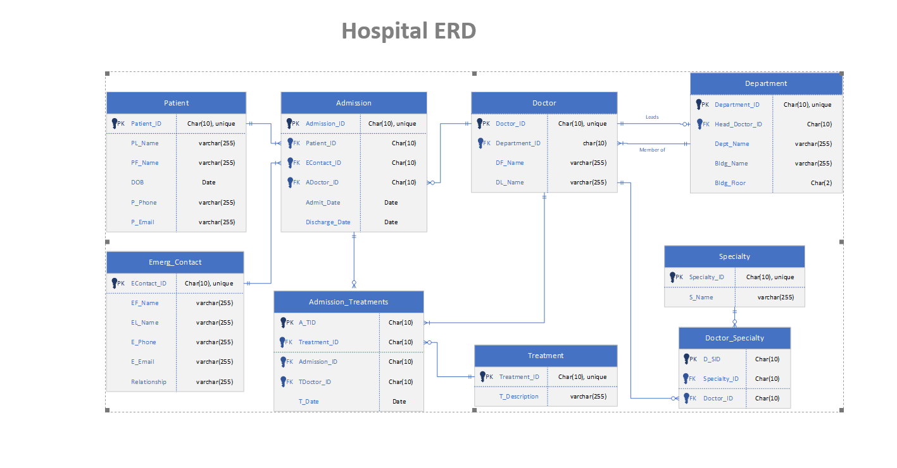

# Hospital-Inpatient-Information-System

## Project Requirements:

No-Where-To-Be-Found Hospital (NWTBF) hires your team to develop a “Hospital Inpatient Information System” (HIIS). Your deliverables should contain an ERD and the complete SQL script. Your deliverables have to fulfill ALL of the following functional and non-functional requirements. 

## Functional Requirements: 

*	Generate an ERD based on the requirements. 
*	It is quite possible that different people share the same first and last names. Thus it is not acceptable to use a person’s first   and last name to identify a person. 
*	Each inpatient has a unique patient ID when the patient is admitted to the hospital at the first time. This ID will not change throughout the patient’s life time. Each patient also has a first name, last name, date of birth, a phone number, and an email. 
*	Every time when an inpatient is admitted to the hospital, the patient will be assigned to a hospital admission ID. Note, unlike the patient ID, this admission ID will change every time when the patient is admitted to the hospital. For each admission, besides the admission ID, HIIS also needs to record the dates that the patient is admitted and released from the hospital, and the doctor who is in charge of this patient for this admission. 
*	For each admission, each inpatient should have one emergency contact person. HIIS needs to keep track of that person’s unique contact ID, first and last name, a phone number, an email, and the relationship to the patient. Note the emergency contact person may be different at different admissions. 
*	For each admission, an inpatient may experience multiple treatments. 
*	Each treatment should have a unique treatment ID, treatment date, treatment description, and exactly one doctor who is in charge of the treatment. Note the doctor in charge of a treatment may or may not be the same as the doctor who is in charge of that inpatient for this admission. 
*	For each doctor, HIIS will record the unique doctor ID, first and last name, department, and the list of specialties. Note each doctor can have any number of specialties. Each doctor can only be associated to one and exactly one department. 
*	Each department has a unique department ID, department name, building name, floor number, and exactly one department head doctor. 
*	Generate the corresponding SQL script based on your ERD. 
*	The SQL script should create the database named “HIIS” and all the tables, insert at least 5 records in each table, and perform the following query practices. The query practices actually serve to test the correctness of your HIIS design. If a critical link between tables is missing, mostly the related query can not be performed. 
*	For each inpatient, list all his admission records including patient’s ID, name, the dates that the patient is admitted and released from the hospital, and the doctor (ID and name) who is in charge of this patient for this admission.
*	For each patient, list the patient’s ID and name, the ID and name of the doctors who have ever been in charge of that patient’s admissions (not treatments!), and the number of times that doctor has been the doctor-in-charge for that patient. 
*	For each inpatient, list the patient’s ID, name, and all his emergency contact persons’ ID and name. 
*	For a specific inpatient’s specific admission record (you can choose anyone in your system), list all his treatments including the patient’s ID, name, the dates of the treatments, each treatment description, and each treatment’s doctor’s ID and name.
*	For each doctor, list the doctor’s ID, name and all his specialties. 
*	For each department, list the department name, its head doctor’s ID, name and his specialties. 
*	For each department, list the department name, all of its doctors’ IDs, names and the number of each doctor’s specialties. 

## Non-Functional Requirements: 

*	Your HIIS design should try to reduce unnecessary redundancies as much as possible. 
*	The ERD can be originally created by MS Visio or similar software.
*	Insert the ERD figure to a Word file. 
*	Add any necessary comments or explanations below the ERD figure in order to facilitate your client to understand your ERD.
*	The SQL script should be based the MySQL DBMS. 
*	It is extremely important that the ERD and the SQL script are consistent in every way! 
*	You may apply your best assumptions to determine a cardinality if that cardinality related information is NOT available in this     requirement document. 
*	You may apply your best assumptions to determine whether a field (column) is mandatory or optional. 
*	Your assumptions have to be intuitively correct. 
*	The script has to include necessary and illustrative documentations in order to facilitate your client to understand your script.

## Database Schema

Patient:  Patient_ID (PK), PL_name, PF_Name, DOB, P_Phone, P_Email
Admission:  Admission_ID (PK), Patient_ID (FK), EContact_ID (FK), ADoctor_ID (FK),  Admit_Date, Discharge_Date
Emergency_Contact:  EContact_ID (PK), EF_Name, EL_Name, E_Phone, E_Email, Relationship
Doctor:  Doctor_ID (PK), Department_ID (FK), DF_Name, DL_Name
Doctor_Specialty:  D_SID (PK), Specialty_ID (FK), Doctor_ID (FK)
Specialty:  Specialty_ID (PK), S_Name
Department: Department_ID (PK), Head_Doctor_ID (FK), Dept_Name, Bldg_Name, Floor
Treatment:  Treatment_ID (PK), T_Description
Admission_Treatments:  A_TID (PK), Treatment_ID (FK), Admission_ID (FK), TDoctor_id (FK), T_Date

Assumptions

1.	Patients cannot exist in the database without their first admission.  So, each admission is associated with 1 and only 1 patient, but a patient must have 1 or more admissions.
2.	For each admission, only one doctor is responsible for the patient during their entire admission.
3.	Each doctor can perform 1 or more treatments.  Each treatment has only 1 doctor who is responsible.
4.	Each doctor can have any number of specialties.  Every doctor has at least one specialty.
5.	Each Head_Doctor can only be the head doctor of one department.
6.	Each department must have at least one doctor.

